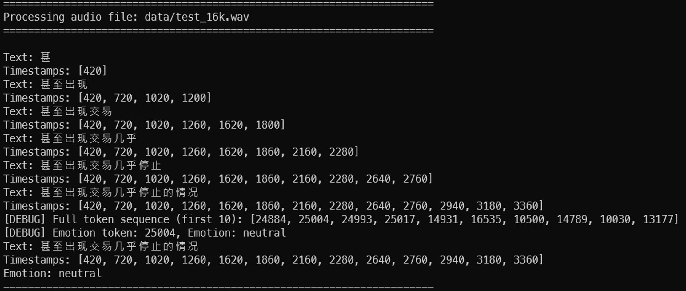
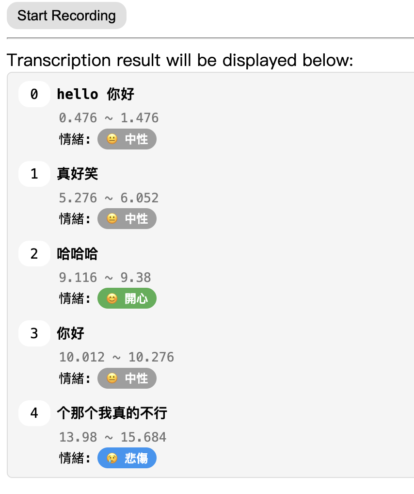

# streaming-sensevoice

Streaming SenseVoice processes inference in chunks of [SenseVoice](https://github.com/FunAudioLLM/SenseVoice).

## Features

- 🎯 **Real-time Speech Recognition**: Streaming inference with low latency
- 🎭 **Emotion Recognition**: Detect emotions (happy, sad, angry, neutral) from speech
- 🔊 **Built-in VAD**: Automatic voice activity detection for speech segmentation
- 🌐 **WebSocket Support**: Real-time transcription via WebSocket with MP3 streaming

## Usage

### Basic Transcription

- **Transcribe WAV file**

```bash
python main.py
```



- **Transcribe from microphone**

```bash
python realtime.py
```

### WebSocket Real-time Transcription

A WebSocket service built with [`Recorder`](https://github.com/xiangyuecn/Recorder) and `FastAPI`. The frontend uses `MP3` format to transmit audio for reduced latency and increased stability.

```bash
pip install -r requirements-ws-demo.txt
python realtime_ws_server_demo.py

# Check CLI options
python realtime_ws_server_demo.py --help
```


**Features:**
- Real-time speech-to-text transcription
- Automatic emotion detection on speech end
- VAD-based speech segmentation
- Low-latency MP3 audio streaming

### Emotion Recognition

The model supports emotion recognition with the following labels:
- `happy` 😊 - Happy/joyful speech
- `sad` 😢 - Sad/sorrowful speech
- `angry` 😠 - Angry/frustrated speech
- `neutral` 😐 - Neutral/calm speech
- `unk` ❓ - Unknown/uncertain emotion

**Test emotion recognition with audio files:**

```bash
python test/test_audio_emotion.py
```

**Example with VAD:**

```python
from streaming_sensevoice import StreamingSenseVoice

# Enable VAD for automatic speech segmentation
model = StreamingSenseVoice(
    enable_vad=True,
    vad_threshold=0.5,
    vad_min_silence_duration_ms=550
)

# Process audio chunks
for res in model.streaming_inference(audio_chunk):
    print(res["text"])  # Real-time text output
    
    if "emotion" in res:  # Emotion available when speech ends
        print(f"Emotion: {res['emotion']}")
```

